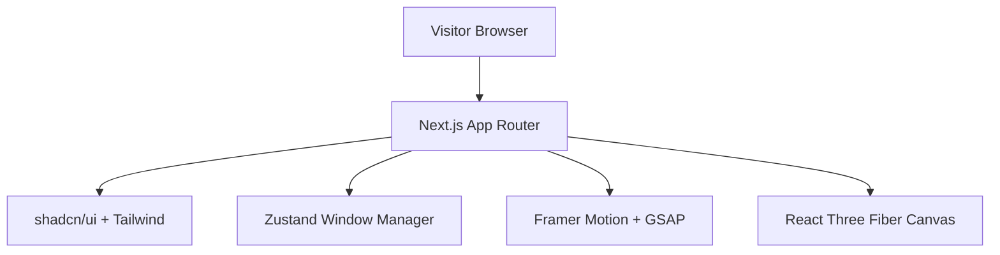

# System Architecture

## 1. High-Level Architecture

## 2. Core Technological Stack
- **Framework**: Next.js (App Router) / React
- **Styling**: Tailwind CSS
- **Component Primitives**: shadcn/ui and custom SVGs
- **State Management**: Zustand
- **Animations**: Framer Motion (Transitions) + GSAP (Dock logic/Timelines)
- **3D Rendering**: React Three Fiber (r3f) (Isolated Background layer)

## 3. Window Management Subsystem (Zustand)
The core logic driving the MacOS feel relies on a global state predicting OS window behaviors:
- `openWindows`: Array of active window IDs.
- `activeWindowId`: String identifying which window is focused (`z-index: 50`).
- `windowPositions`: X/Y coordinate memory for restored states.

**Data Flow**:
`Click Dock Icon` → `dispatch({ type: 'OPEN_APP', id: 'about' })` → `Zustand State Update` → `Framer Motion unmount/mount animation` → `React UI renders draggable Window component.`

## 4. Atomic Design Implmentation Pattern
Because the UI relies on complex overlapping systems, components will follow strict atomic principles:
- **Atoms**: Isolated SVG icons, traffic light buttons.
- **Molecules**: Dock items, Sidebar items.
- **Organisms**: The Window Frame, Menu Bar.
- **Templates**: Full Desktop composition.
